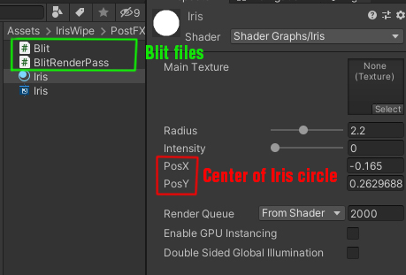
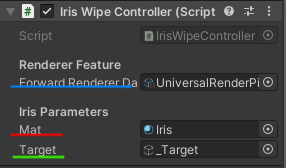
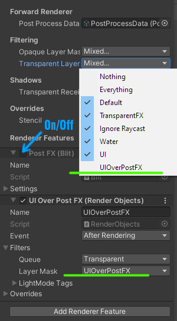
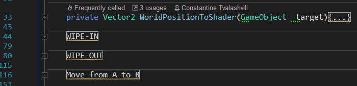

# Iris Wipe - URP PostFX with Controller <h1> 

 Iris wipe post fx with **Blit** command buffer on **Universal Render Pipeline**.

  

  Assign a 2D or 3D gameObject to the "Target" variable of the controller script and it will automatically pass position to the shader

 

  Set the gameObject layer to **UIOverPostFX** if you want the object to stay above the effect

 

  Invoke this 3 methods for controlling iris effect. **Transition-In, Move FromAtoB, Transition-Out**.

 
